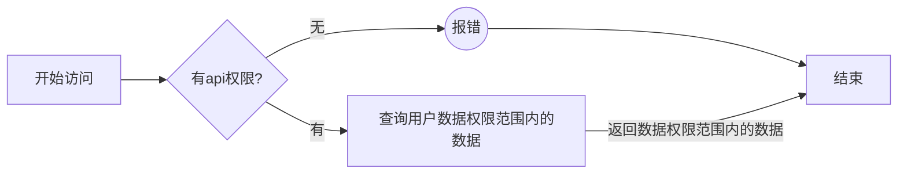
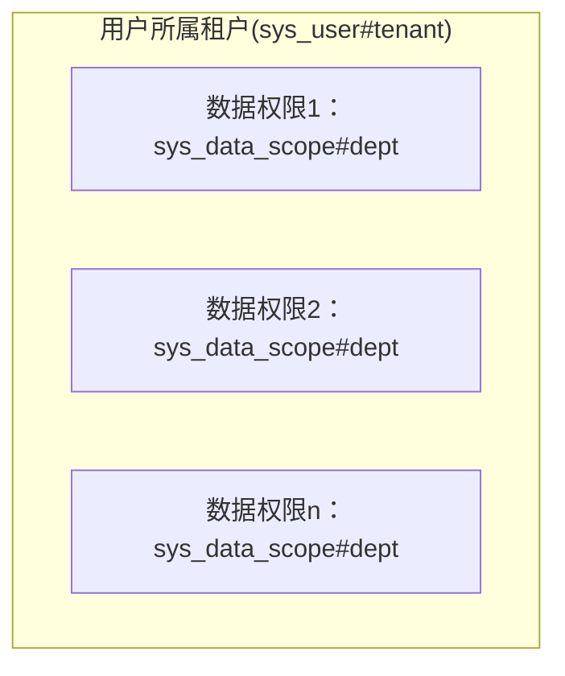

## 技术栈

| 技术栈          | 版本                                                         | since        | remove       |
| --------------- | ------------------------------------------------------------ | ------------ | ------------ |
| 微服务 & 脚手架 |  | `1.0.0` |              |
| 微服务 & 脚手架 |  | `1.0.0` | `1.0.0` |
| orm框架         |  | `1.0.0` |              |
| 数据库          |  | `1.0.0` |              |
| 权限框架        |  | `1.0.0` |              |
| 对象存储        |  | `1.0.0` |              |
| 文档生成器      |  | `2021.0.1.E` |              |
| 文档生成器      |  | `1.0.0` | `2021.0.1.E` |
| 分布式定时任务  |  | `1.0.0` |              |
| 消息队列        |  | `1.0.0` |              |
| arthas          |  | `1.0.0` |              |
| ……              | ……                                                           |              |              |

## Feature

| 序号 | 说明                                                         | since        | remove       | replace |
| :--: | ------------------------------------------------------------ | ------------ | ------------ | ------- |
|  1   | 网关支持——`gateway`                                          | `1.0.0` |              |         |
|  2   | 注册中心支持——`nacos` 注：nacos2.2.0                    | `1.0.0` |              |         |
|  3   | 注册中心支持——`nacos` 注：nacos1.4.2                    | `1.0.0` | `1.0.0` | NO.2    |
|  4   | 配置中心支持——`nacos` 注：nacos2.2.0                    | `1.0.0` |              |         |
|  5   | 配置中心支持——`nacos` 注：nacos1.4.2                    | `1.0.0` | `1.0.0` | NO.4    |
|  6   | 认证授权鉴权（网管不作统一鉴权，各微服务各自鉴权）——`oauth2 + spring-security` | `1.0.0` |              |         |
|  7   | 跨微服务调用——`feign`                                        | `1.0.0` |              |         |
|  8   | 入参出参记录支持——`EnableParameterRecorder + RecordParameters + IgnoreRecordParameters` | `1.0.0` |              |         |
|  9   | 参数校验支持——`JSR303`                                       | `1.0.0` |              |         |
|  10  | 全局异常处理器——`spring mvc全局异常处理器`                   | `1.0.0` |              |         |
|  11  | 分布式锁支持——`redisson`                                     | `1.0.0` |              |         |
|  12  | po模型自动填充createdBy、createdAt、updatedBy、updatedAt字段——`mybatis-plus` | `1.0.0` |              |         |
|  13  | 多租户支持——`mybatis-plus自定义多租户like插件`               | `1.0.0` |              |         |
|  14  | 文件存储支持——`spring-file-storage`                          | `1.0.0` |              |         |
|  15  | api文档支持——`knife4j`                                       | `2021.0.1.E` |              |         |
|  16  | api文档支持——`smart-doc`                                     | `1.0.0` | `2021.0.1.E` | NO.15   |
|  17  | 通用功能选择支持——`@EnableJdFeature` 注：在不同微服务中，根据业务场景需要，通过注解`@EnableJdFeature`一键启用相关功能 | `1.0.0` |              |         |
|  18  | 租户隔离、租户内数据定向分层隔离                             | `1.0.0` |              |         |

## 编码规范

| 序号 | 规范                                                         |     类别     |
| :--: | :----------------------------------------------------------- | :----------: |
|  1   | 所有api应当只支持一类方法（`POST | GET | PUT`等）            | Restful接口  |
|      | 同微服务下，所有的api应该保证uri的唯一（，不能通过请求方法来区分） |              |
|      | 增语义api用`POST`                                            |              |
|      | 删语义api用`DELETE`                                          |              |
|      | 改语义api用`PUT`                                             |              |
|      | 查列表语义api用`POST`                                        |              |
|      | 查详情语义api用 - `GET`：当查询参数只有一个时 - `POST`：当查询参数多于一个时  |              |
|  2   | 所有改语义接口的参数，只有id是必传的，其余都非必填           |  改语义接口  |
|      | 当修改时，若后端接收到的字段值： - 为`null`：则不修改该字段（若有特殊需求，需要将值清空，优先选择将其置为`空字符串`，如果实在要置为`null`，需要新开一个api） - 为`空字符串`：则视字段业务含义而定，不作修改或将改为空字符串 |              |
|  3   | 对controller内的api方法，应按照`增、删、改、查、其它`，这样的顺序排序 |   接口排序   |
|  4   | 所有请求入参模型，应基础基类`BaseDTO`                        |   接口参数   |
|      | 所有分页请求入参模型，应基础基类`BasePageDTO`                |              |
|  5   | 所有redis key的定义，应统一定义在`CachePrefixEnum`中，并与已有的key保持同样的命名规范 如：`AC_USER_TENANT("access-control:%s:tenant", "访问控制-用户所属租户. 占位符为userId")` |  reids规范   |
|  6   | common-ds包下的代码，应按照`工具属性 > 所属主体 > 工具子属性`进行归档 |   代码归档   |
|      | common-spring包下的代码，应按照`工具属性 > 工具子属性 `进行归档 |              |
|  7   | 所有接口、接口方法上应写上注释                               |   注释规范   |
|      | 子类方法上的注释不用写（因为接口上写了），除非有特别值得说明的东西 |              |
|      | 内部private级别的方法，若望名知义则可以不写注释              |              |
|      | 关键逻辑代码行，需要写上说明                                 |              |
|      | 涉及到比较多业务处理的代码，需要写上step说明                 |              |
|  8   | 所有模型的维护都需要维护进`com.ideaaedi.springboot.jd.commonbase.entity`下 - 通用模型，直接放在`com.ideaaedi.springboot.jd.commonbase.entity`下即可 - 隶属于某个微服务的模型，应放在`com.ideaaedi.springboot.jd.commonbase.entity.{微服务}`下，其中： &emsp; - po：存放与表完全对应的模型 &emsp; - vo：存放api入参出餐模型（`vo.req`：存放api入参模型；`vo.resp`：存放api出参模型） &emsp; - bo：业务中间模型 &emsp; - dto：数据传输模型（与第三方系统、中间件等交互时，存放进dto模型，可细存放到`dto.{交互方}.{类型}`下） |  entity维护  |
|  9   | 所有state字典值，都需要维护进`POState`                       |  state字典   |
|  10  | 所有substate字典值，都需要维护进`POSubstate`                 | substate字典 |
|  11  | 如果你有一套自我成熟的编码规范（评判标准是：写得好看），则按照自己的即可；无则按照阿里规范 |   其余规范   |

## 接口权限 & 数据权限

> 在本架构中，访问数据，首要要有相应接口的权限，然后再要有数据的权限才行；如果没有接口的权限，那么访问时会直接报错；如果有接口的权限，但是没有数据的权限，那么访问接口时，返回的数据可能为空，可能只有一部分，因为其余的数据你没有数据权限。

- 接口流程

- 数据权限

  > 公式说明
  > $$
  > 用户所属租户
  >   \quad \bigcap \quad
  > (  用户数据权限1
  >    \quad \bigcup \quad
  >    用户数据权限2
  >    \quad \bigcup \quad
  >    \ldots
  >    用户数据权限n
  > )
  > $$
  > 文字说明
  >
  > 1. 用户最终的数据权限范围 = `用户租户范围sys_user.tenant`与`sys_data_scope表配置的用户所有数据范围dept_id和`的交集
  > 2. 用户的数据权限配置（`sys_data_scope表的dept_id字段`对应的tenant，即为数据权限），可以有多个，多个时求并集
  > 3. 用户的数据权限，可细分到某个具体的api上，只有当请求的url匹配指定的api时，该数据权限范围才会生效（即：通过在`sys_data_scope表的api_ids字段`指定api）

