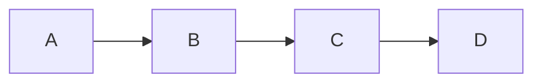
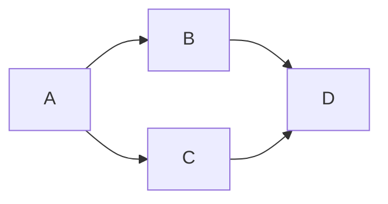
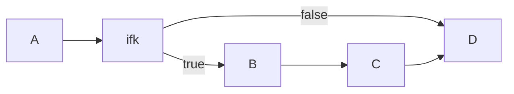
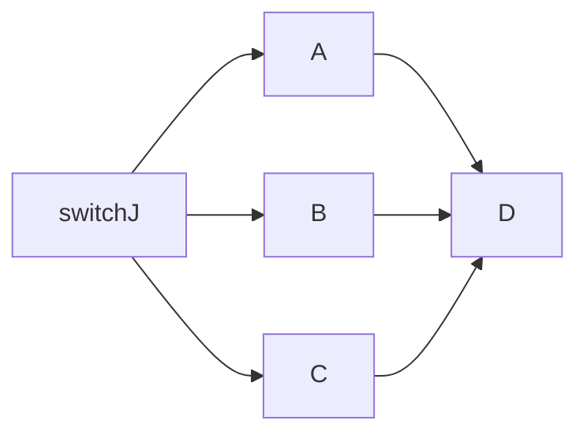

> 提示：请使用markdown插件进行mermaid流程图预览

假设我们我们的业务最开始的流程是：chainX

```mermaid
graph LR
A --> B;
B --> C;
C --> D;
```

后来业务变动，要改成：chainY

```mermaid
graph LR
A --> B;
A --> C;
B --> D;
C --> D;
```

后来业务又变动，要改成：chainZ

```mermaid
graph LR
A --> ifk;
ifk --true--> B --> C;;
ifk --false--> D;
C --> D;
```

后来业务又变动，要改成：chainM

```mermaid
graph LR
switchJ --> A;
switchJ --> B;
switchJ --> C;
A --> D;
B --> D;
C --> D;
```
本[XyzDemoTest](../XyzDemoTest.java)对这样的变化进行演示